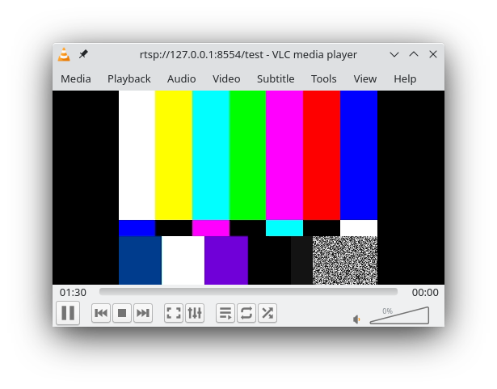

Make sure that the following packages are installed on your system. `gstreamer, gst-rtsp-server`.
On Manjaro Linux they can be simple installed with pacman.

Before you can install PyGObject (gi) with pip, you need to install the following packages on your system.
```bash
sudo pacman -S python cairo pkgconf gobject-introspection gtk3
```

Open a terminal and enter your virtual environment. Install `pycairo` and `PyGObject`.

```bash
pip3 install pycairo
pip3 install PyGObject
```

Run the sample python script.
```bash
python3 basic.py
```

Open a terminal and connect to the rtsp stream.
```bash
vlc rtsp://127.0.0.1:8554/test
```

You should see test video.



Check
